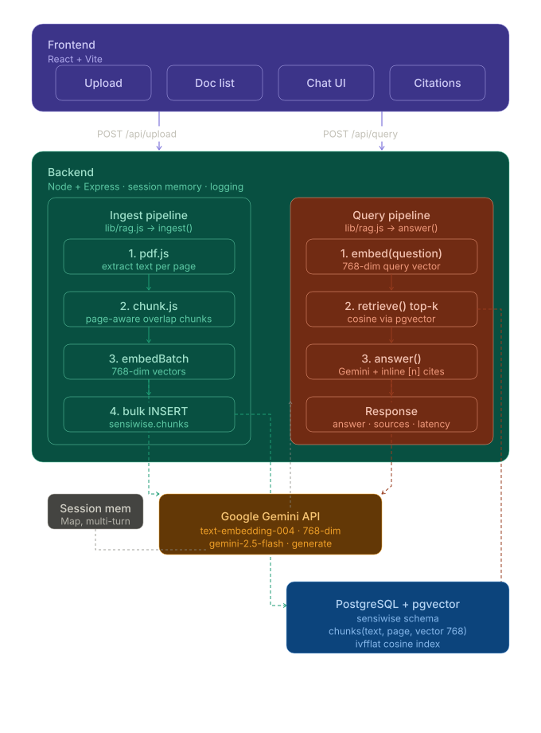

# Sensiwise — AI-Powered Document Intelligence Assistant



Upload one or more **PDF documents** and ask questions about their content through a
chat interface. The system uses **Retrieval-Augmented Generation (RAG)**: it extracts
text from each PDF, embeds and stores it in a vector database, retrieves the most
relevant passages for a question, and asks an LLM to answer — **with inline citations
to the exact document and page** used.

**Stack:** React (Vite) · Node.js / Express · Google **Gemini** via `@google/genai`
(`gemini-2.5-flash` + `text-embedding-004`, 768-dim) · **PostgreSQL + pgvector** (schema `sensiwise`).

---

## Architecture

```
                          ┌──────────────────────────────┐
                          │      FRONTEND (React/Vite)     │
                          │   upload PDFs · ask questions  │
                          │   show answer + citations      │
                          └───────┬───────────────┬────────┘
                   POST /api/upload│               │ POST /api/query
                                  ▼               ▼
                          ┌──────────────────────────────┐
                          │     BACKEND (Node/Express)     │
                          └───────┬───────────────┬────────┘
            ══ INGEST FLOW ══     │               │     ══ QUERY FLOW ══
                                  ▼               ▼
              ┌───────────────────────┐   ┌──────────────────────────┐
              │ 1 extract text (pdf-   │   │ 1 embed the QUESTION      │
              │   parse, per page)     │   │   (Gemini, 768-d)         │
              │ 2 chunk (180w / 40 ov) │   │ 2 vector search top-5     │
              │ 3 embed chunks (Gemini)│   │   (pgvector  <=> cosine)  │
              │ 4 store vectors        │   │ 3 build context + cite    │
              └──────────┬────────────┘   │ 4 Gemini writes answer    │
                         │                └──────┬─────────────┬──────┘
                         ▼                       ▼             │
              ┌─────────────────────┐   ┌──────────────────┐  │
              │  PostgreSQL + pgvec  │◄──┤  nearest chunks  │  │
              │  schema: sensiwise   │──►│  (text + page)   │  │
              │  documents / chunks  │   └──────────────────┘  │
              │  embedding vector(768)                         ▼
              └─────────────────────┘            ┌──────────────────────┐
                         ▲                        │   Google Gemini API   │
                         └────────────────────────┤ embeddings + 2.5-flash│
                                                  └───────────┬───────────┘
                                                              ▼
                                                  answer + [1][2] citations → UI
```

**Two flows out of the backend:**
- **Ingest:** PDF → text → chunks → vectors → Postgres. *(LLM not involved yet.)*
- **Query:** question → vector → nearest chunks from Postgres → Gemini → cited answer.

See **[ARCHITECTURE.md](ARCHITECTURE.md)** for the component breakdown and
**[TECHNICAL_NOTE.md](TECHNICAL_NOTE.md)** for design decisions / trade-offs.

---

## How RAG works here (embeddings in plain terms)

An **embedding** turns a piece of text into a list of **768 numbers that captures its
meaning** — a coordinate in a "meaning-space." Text with similar meaning gets similar
numbers, even when the words differ:

```
"deadline is 72 hours"   → [ 0.021, -0.044, 0.110, ... ]  ┐ nearly the same point
"when must I submit by?"  → [ 0.019, -0.041, 0.108, ... ]  ┘ (similar meaning)
"home-office stipend"     → [-0.130,  0.250, 0.004, ... ]    far away
```

This is why retrieval is **meaning-based, not keyword-based** — "when must I submit?"
finds the "72 hours" passage despite sharing no words.

- **Ingest** embeds every chunk (`taskType: RETRIEVAL_DOCUMENT`) and stores the vector
  in `chunks.embedding vector(768)`.
- **Query** embeds the question (`taskType: RETRIEVAL_QUERY`) into the *same* space,
  then pgvector's cosine operator (`<=>`) finds the nearest chunks.
- The top chunks (with their page numbers) become the context Gemini must answer from,
  which keeps answers grounded and lets it cite `[1] file p.2`.

---

## Setup

### Prerequisites
- Node 18+
- PostgreSQL with the **pgvector** extension (e.g. a free Neon database)
- A Google **Gemini** API key

### 1. Backend
```bash
cd backend
npm install
# .env is provided (Gemini + Postgres, POSTGRES_SCHEMA=sensiwise).
# Or: cp .env.example .env  and fill in your own credentials.
npm run setup     # creates schema sensiwise + tables + pgvector index
npm run dev       # API on http://localhost:3001

# Optional: one-command end-to-end check (ingests the assignment PDF, asks questions, asserts answers)
node test_e2e.js
```

### 2. Frontend
```bash
cd ui
npm install
npm run dev       # http://localhost:5173  (proxies /api -> :3001)
```

Open **http://localhost:5173**, upload a PDF, and start asking.

---

## API

| Method | Route | Purpose |
|--------|-------|---------|
| `POST` | `/api/upload` | multipart `files[]` (PDFs) → extract, chunk, embed, store |
| `GET`  | `/api/documents` | list uploaded documents |
| `DELETE` | `/api/documents/:id` | delete a document + its chunks |
| `POST` | `/api/query` | `{ question, documentIds?, sessionId? }` → answer + sources |
| `GET`  | `/api/health` | health check |

**Query response**
```json
{
  "answer": "The submission deadline is 72 hours from receipt [1].",
  "confidence": 0.69,
  "sources": [
    { "n": 1, "filename": "spec.pdf", "page": 1, "similarity": 0.69,
      "snippet": "Submission Deadline: 72 hours from receipt…" }
  ],
  "latencyMs": 1180
}
```

---

## Features

**Core (required)**
- PDF upload (single or multiple), text extraction, chunking, embeddings, vector retrieval, LLM answer.
- Inline citations + a sources panel showing the exact page and excerpt used.
- Clean, professional chat UI with an upload area and document list.

**Optional enhancements implemented**
-  **Multi-document querying** — ask across all docs or scope to selected ones.
-  **Conversation memory** — follow-up questions use recent turn history (per session); "New chat" resets it.
-  **Relevance/confidence score** surfaced per answer.
-  **Markdown-rendered answers** with highlighted citations.
-  **Logging** — structured server logs for ingest and query (latency, confidence).
-  **Graceful edge cases** — image-only PDFs and out-of-document questions are handled.

---

## Project layout
```
sensiwise-ai-assignment/
├── backend/                  minimal Express app
│   ├── server.js             API (upload / query / documents) + session memory
│   ├── db.js                 pg pool + helpers (HRMS_lite pattern)
│   ├── gemini.js             embeddings + generation wrappers (@google/genai)
│   ├── schema.sql            sensiwise schema (pgvector)
│   ├── setup.js              create schema + tables + size vector index to row count
│   ├── test_e2e.js           one-command self-checking RAG test
│   └── lib/
│       ├── pdf.js            per-page PDF text extraction
│       ├── chunk.js          page-aware overlapping chunking
│       └── rag.js            ingest + retrieve + answer pipeline
└── ui/                       Vite + React (upload, doc list, chat w/ citations)
```
